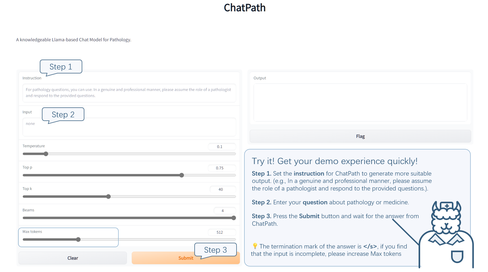

<p align="center" width="100%">
<a ></a>
</p>


[](https://github.com/tatsu-lab/stanford_alpaca/blob/main/LICENSE)
[](https://github.com/tatsu-lab/stanford_alpaca/blob/main/DATA_LICENSE)

## PathGPT: A Knowledgeable GPT Model for Pathology

Welcome to the PathGPT repository! PathGPT is a specialized language model tailored for the field of pathology. Developed by fine-tuning the Llama-7B model using a dataset of 13,000 pathology-specific questions and answers we've collected. We're excited to announce the release of the PathGPT checkpoint (the weight diff of Llama), with the full 13k dataset to follow shortly.  The detailed data collection process will also be made public.

But we're not stopping there! In the future, we plan to expand the dataset to over 100,000 entries, encompassing a diverse range of pathology-related instruction data. We believe that PathGPT will become an valuable tool for pathologists and the entire pathology community.

### **Authors**

This project was completed by **Yuxuan Sun** and **Chenglu Zhu** from the **Artificial Intelligence and Biomedical Image Analysis Lab** of the School of Engineering at Westlake University. We would like to thank **Kai Zhang** (Ohio State University) for participating in the discussion and collaboration, as well as the following individuals who contributed to the annotation process: **Xinheng Lv** and **Ruojia Zhao**.


## Get your demo experience!!

We deployed PathGPT on the A100 server and opened it up for user experience.  You can follow the instruction illustrated  below.  The demo webset is: https://776628862fb9bcae.gradio.app.  Please feel free to point out the problems our model.

<p align="center" width="100%">
<a ></a>
</p>


<h2 id="usage">Usage</h2>

- Setup. Install the conda environment:
```bash
conda create -n pathgpt  python=3.10
conda activate pathgpt
git clone https://github.com/superjamessyx/PathGPT.git
cd PathGPT/src
conda install pytorch==1.12.0 torchvision==0.13.0 torchaudio==0.12.0 cudatoolkit=11.3 -c pytorch
git clone https://github.com/huggingface/transformers.git
cd transformers
pip install -e .
cd ../..
pip install -r requirements.txt
```

- Training data 

  Taking into account that our present data collection focuses solely on pathology-related QA pairs, an exclusive emphasis on QA training may hinder PathGPT's ability to effectively carry out other tasks. To address this limitation, we initially fine-tune the model using Stanford [Alpaca](https://crfm.stanford.edu/2023/03/13/alpaca.html) data, followed by further fine-tuning with our pathology-specific data. This approach enables PathGPT to adeptly handle a diverse range of questioning styles.
```bash
PathGPT/src/data/pathology_alpaca.json
```

- Convert LLaMA checkpoint to HuggingFace format:
```bash
cd PathGPT/src
python transformers/src/transformers/models/llama/convert_llama_weights_to_hf.py \
    --input_dir /path/to/llama-7B/ \
    --model_size 7B \
    --output_dir /path/to/llama-7B/hf
```

- To train LLaMA-7B with DeepSpeed, you can select either DeepSpeed Zero-2 or Zero-3 by using the following command options: `--deepspeed configs/ds_config_zero2.json` or `configs/ds_config_zero3.json`:
```bash
deepspeed train.py \
    --model_name_or_path /path/to/llama-7B/hf \
    --data_path /path/to/pathology_alpaca.json \
    --output_dir /path/to/llama-7B/hf/ft \
    --num_train_epochs 3 \
    --model_max_length 512 \
    --per_device_train_batch_size 64 \
    --per_device_eval_batch_size 1 \
    --gradient_accumulation_steps 1 \
    --evaluation_strategy "no" \
    --save_strategy "steps" \
    --save_steps 100 \
    --save_total_limit 2 \
    --learning_rate 2e-5 \
    --warmup_steps 2 \
    --logging_steps 2 \
    --lr_scheduler_type "cosine" \
    --report_to "tensorboard" \
    --gradient_checkpointing True \
    --deepspeed configs/ds_config_zero2.json \
    --fp16 True
```
- Train LLaMA-7B on DeepSpeed with Multi-nodes
```bash
deepspeed --num_gpus num_of_gpus_in_each_node \
    --num_nodes num_of_nodes \
    --master_addr ip_address_of_main_node \
    --master_port 34545 \
    --hostfile configs/hostfile \
    train.py \
    --model_name_or_path /path/to/llama-7B/hf \
    --data_path /path/to/pathology_alpaca.json \
    --output_dir /path/to/llama-7B/hf/ft \
    --num_train_epochs 3 \
    --model_max_length 512 \
    --per_device_train_batch_size 64 \
    --per_device_eval_batch_size 4 \
    --gradient_accumulation_steps 1 \
    --evaluation_strategy "no" \
    --save_strategy "steps" \
    --save_steps 100 \
    --save_total_limit 2 \
    --learning_rate 2e-5 \
    --warmup_steps 2 \
    --logging_steps 2 \
    --lr_scheduler_type "cosine" \
    --report_to "tensorboard" \
    --gradient_checkpointing True \
    --deepspeed configs/ds_config_zero2.json \
    --fp16 True
```


- Training Cost

Training 7B model with `13k examples/ 3 epoch` & `batch_size=32` within `1 hour` on `4 x A100 GPUs`.

| LLaMA | Batch Size | A100s | Time (h) |
| ----- | ---------- | ----- | -------- |
| 7 B   | 32         | 4     | 1        |


- Inference
```bash
# web demo inference
python generate.py
```

## Download fine-tuned checkpoint

We have released the weight difference ([huggingface](https://huggingface.co/jamessyx/ChatPath)) between the finetuned weights and the original llama weights. By simply adding this difference to the latter, you can obtain the finetuned weights.

## Example outputs

*How to distinguish the distribution pattern of immune cells in solid tumors of H&E staining images?*

**Alpaca**

The distribution pattern of immune cells in solid tumors can be determined by examining H&E stained slides. Immunohistochemical stains such as CD3, CD8, CD4, and CD20 can be used to identify T-cells, B-cells, and antigen-presenting cells, respectively. Additionally, macrophages can be identified with CD68 staining.</s>

**PathGPT**

To distinguish the distribution pattern of immune cells in solid tumors of H&E staining images, the following steps can be followed:

1. Select the area of interest in the H&E staining image.

2. Identify the location of immune cells in the selected area.

3. Count the number of immune cells in the selected area.

4. Calculate the percentage of immune cells in the selected area.

5. Compare the percentage of immune cells in the selected area with the percentage of immune cells in normal tissues.

6. Analyze the distribution pattern of immune cells in the selected area.

7. Compare the distribution pattern of immune cells in the selected area with the distribution pattern of immune cells in normal tissues.

8. Evaluate the significance of the distribution pattern of immune cells in the selected area.

By following these steps, it is possible to distinguish the distribution pattern of immune cells in solid tumors of H&E staining images.</s>


## Thanks For

This project is based on 

[Llama-X](https://github.com/AetherCortex/Llama-X)

and also relate to multiple open source projects:

[Meta AI LLaMA](https://arxiv.org/abs/2302.13971v1)

[Huggingface Transformers Llama](https://github.com/huggingface/transformers/tree/main/src/transformers/models/llama)

[Alpaca](https://crfm.stanford.edu/2023/03/13/alpaca.html) and [Alpaca-LoRA](https://github.com/tloen/alpaca-lora)


## Disclaimer

The use of resources(e.g., code, data and model weights) related to this project is limited to academic research and is prohibited for commercial purposes. The content generated by PathGPT is subject to factors such as randomness and uncontrollability, and this project cannot guarantee its accuracy. This project does not assume any legal responsibility for the content of the model output, nor does it assume any responsibility for any losses that may arise from the use of related resources and output results.


